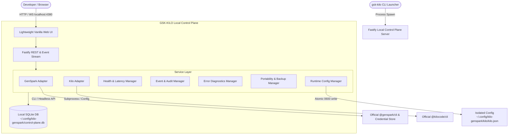

# GSK-KILO Local Control Plane Architecture Specification

**Document Version:** 1.0.0  
**Status:** Approved Architecture Draft  
**Target Component:** `GSK-KILO Local Control Plane & Web Dashboard`  
**Classification:** Internal Technical Architecture  

---

## 1. Product Definition

### 1.1 Vision
The **GSK-KILO Local Control Plane** is a lightweight, local-first control and observability system for developers using their **GenSpark AI subscription** as the intelligence backend behind the **Kilo Code** terminal AI assistant.

It provides a transparent, secure, and self-healing local dashboard bound strictly to `127.0.0.1` that monitors connection health, tracks model catalogs, manages provider configurations, audits system events, and surfaces structured diagnostics without introducing external cloud services, telemetry, or security risks.

```
┌──────────────────────────────────────────────────────────────────────────┐
│                        GSK-KILO CONTROL PLANE                            │
│                                                                          │
│  ┌──────────────────────┐  ┌──────────────────────┐  ┌────────────────┐  │
│  │   GenSpark Adapter   │  │     Kilo Adapter     │  │ System Doctor  │  │
│  │ (Auth / Models / API)│  │ (Config / CLI / ACP) │  │  (Diagnostics) │  │
│  └──────────┬───────────┘  └──────────┬───────────┘  └───────┬────────┘  │
│             │                         │                      │           │
│             ▼                         ▼                      ▼           │
│  ┌────────────────────────────────────────────────────────────────────┐  │
│  │                 Fastify Local Server (127.0.0.1)                   │  │
│  │                SQLite Store  •  Lightweight Web UI                 │  │
│  └────────────────────────────────────────────────────────────────────┘  │
└────────────────────────────────────┬─────────────────────────────────────┘
                                     │
                 ┌───────────────────┴───────────────────┐
                 ▼                                       ▼
    ┌─────────────────────────┐             ┌─────────────────────────┐
    │      GenSpark API       │             │        Kilo Code        │
    │  (Official LLM Proxy)   │             │   (Terminal Assistant)  │
    └─────────────────────────┘             └─────────────────────────┘
```

### 1.2 What It IS
* **Local Control & Diagnostic Plane**: A single-process daemon and web dashboard running locally on the developer's workstation.
* **Health & Status Aggregator**: Observes GenSpark CLI authentication status, quota/credit indicators, API latency, and model availability.
* **Provider & Catalog Manager**: Dynamically discovers models exposed by GenSpark (36+ models), sanitizes configuration schemas, and synchronizes with Kilo's isolated runtime.
* **Local Event & Audit Journal**: Records configuration changes, CLI lifecycle events, and connectivity errors in a private SQLite database.
* **Machine Portability Assistant**: Exports and imports environment setup profiles across machines without ever exposing or transferring API keys.

### 1.3 What It IS NOT
* **NOT a Cloud SaaS or Multi-Tenant Service**: Zero remote dependencies, zero external database servers, zero cloud hosting.
* **NOT a Middleware / Man-in-the-Middle Proxy**: Kilo communicates directly with GenSpark's official LLM proxy (`https://www.genspark.ai/api/llm_proxy/v1`). The dashboard never sits in the data path of code generation requests.
* **NOT a Third-Party Billing Layer**: Relies 100% on the user's existing GenSpark subscription ($0 extra).
* **NOT an Electron App**: Zero multi-hundred-megabyte binary bloat; built with standard Node.js, Fastify, SQLite, and vanilla modern web assets.

---

## 2. System Architecture

### 2.1 Layered Architecture Overview



### 2.2 Component Hierarchy
1. **Bootstrap Script (`gsk-kilo` / `gsk-kilo-ui`)**:
   Resolves environment PATH, validates Node.js/npm runtime, verifies dependencies, and starts the server or launches Kilo.
2. **Fastify Server (`127.0.0.1:4380`)**:
   Provides REST API endpoints, real-time WebSocket/SSE state synchronization, and serves the lightweight dashboard assets.
3. **Service Layer**:
   * `GenSparkAdapter`: Interfaces with `@genspark/cli` and GenSpark API.
   * `KiloAdapter`: Interfaces with `@kilocode/cli` and inspects model registry.
   * `HealthManager`: Executes scheduled and on-demand passive/active health probes.
   * `EventManager`: Ingests structured lifecycle events into SQLite.
   * `ErrorManager`: Sanitizes, classifies, and suggests resolutions for failures.
   * `PortabilityManager`: Exports/imports machine profiles with strict credential stripping.
   * `RuntimeConfigManager`: Manages atomic reads/writes to `~/.config/kilo-genspark/kilo/kilo.json`.
4. **Data Persistence**:
   SQLite database (`control-plane.db`) residing in `~/.config/kilo-genspark/` (mode `0700`).

---

## 3. Credential Architecture & Invariants

```
┌──────────────────────────────────────────────────────────────────────────┐
│                       CREDENTIAL BOUNDARY MATRIX                         │
├───────────────────────────────┬───────────────────┬──────────────────────┤
│ Location                      │ Contains Secret?  │ Access Mode / Perms  │
├───────────────────────────────┼───────────────────┼──────────────────────┤
│ ~/.genspark-tool-cli/config.json│ YES (Active Key) │ 0600 (User read/write)│
│ ~/.config/kilo-genspark/kilo.json│ YES (Injected Key)│ 0600 (User read/write)│
│ Control Plane SQLite Database │ NO (NEVER)        │ 0600 (Metadata only) │
│ Dashboard REST API Responses  │ NO (NEVER)        │ Masked / Redacted    │
│ Web UI / Frontend LocalStorage│ NO (NEVER)        │ Ephemeral UI state   │
│ Structured Logs / Events      │ NO (NEVER)        │ Auto-Sanitized regex │
│ Project Directories / Git Repos│ NO (NEVER)        │ Untracked / Isolated │
└───────────────────────────────┴───────────────────┴──────────────────────┘
```

### 3.1 Strict Security Invariants
1. **Zero Secret Storage in Database**: The SQLite database stores only operational metadata (account email, subscription tier, credit balance, latency, error codes). Raw API keys, tokens, cookies, or authorization headers are **strictly forbidden** from database insertion.
2. **Zero Secrets in Network Payloads**: REST endpoints returning account info return only `{ "authenticated": true, "email": "user@example.com", "plan": "plus" }`.
3. **Secret Redaction Pipeline**: All log streams, stdout captures, and error traces pass through a deterministic sanitizer before leaving process memory:
   ```javascript
   function sanitizeText(text) {
     return text
       .replace(/gsk_[a-zA-Z0-9_-]{20,}/g, "[MASKED_GSK_KEY]")
       .replace(/(apiKey|api_key|token|authorization|password)["':\s]+["']?([^"',\s]+)/gi, '$1: "[REDACTED]"');
   }
   ```
4. **Isolated Filesystem Permissions**:
   * Runtime Directory: `~/.config/kilo-genspark/` (`0700`)
   * Config Files: `0600`
   * SQLite DB: `0600`

---

## 4. GenSpark Adapter Specification

The `GenSparkAdapter` manages all interactions with the local GenSpark CLI installation and the GenSpark platform.

### 4.1 Interface Definition

```typescript
export interface IGenSparkAdapter {
  isInstalled(): Promise<boolean>;
  getVersion(): Promise<string | null>;
  getAuthStatus(): Promise<GenSparkAuthInfo>;
  login(): Promise<{ success: boolean; authUrl?: string }>;
  logout(): Promise<{ success: boolean; message: string }>;
  getAccountDetails(): Promise<GenSparkAccountDetails>;
  generateProviderConfig(outputFilePath?: string): Promise<GenSparkProviderConfig>;
  discoverProviders(): Promise<GenSparkProvider[]>;
  discoverModels(): Promise<GenSparkModel[]>;
  discoverEndpoints(): Promise<GenSparkEndpoint[]>;
  checkHealth(passiveOnly?: boolean): Promise<GenSparkHealthResult>;
}

export interface GenSparkAuthInfo {
  authenticated: boolean;
  email?: string;
  name?: string;
  plan?: string;
  creditBalance?: number;
  configPath: string;
  lastChecked: string;
}

export interface GenSparkAccountDetails {
  email: string;
  name: string;
  plan: 'free' | 'plus' | 'pro' | 'unlimited';
  creditBalance: number;
  activeFeatures: string[];
}

export interface GenSparkModel {
  id: string;
  providerId: 'genspark-llm-proxy' | 'genspark-gemini-proxy';
  displayName: string;
  contextLimit: number;
  inputLimit: number;
  outputLimit: number;
  modalities: {
    input: ('text' | 'image')[];
    output: ('text' | 'image')[];
  };
  reasoning: boolean;
}

export interface GenSparkHealthResult {
  status: 'HEALTHY' | 'DEGRADED' | 'UNAUTHENTICATED' | 'DOWN';
  latencyMs: number;
  httpStatus: number;
  endpointUrl: string;
  checkedAt: string;
  error?: string;
}
```

### 4.2 Safe Logout Implementation
Because GenSpark CLI may not implement a native destructive remote session invalidation command on all versions, the adapter implements safe local session clearing:
1. Revokes local API key in `~/.genspark-tool-cli/config.json` by overwriting the file atomically with `{}` (mode `0600`).
2. Invalidates cached configuration in `~/.config/kilo-genspark/kilo/kilo.json`.
3. Records an `AUTHENTICATION_REVOKED` event in SQLite.

---

## 5. Kilo Adapter Specification

The `KiloAdapter` controls and inspects the local Kilo Code installation without interfering with the user's global configuration.

### 5.1 Interface Definition

```typescript
export interface IKiloAdapter {
  isInstalled(): Promise<boolean>;
  getVersion(): Promise<string | null>;
  getConfigStatus(): Promise<KiloConfigStatus>;
  getAvailableModels(): Promise<KiloModelCatalogEntry[]>;
  validateRuntimeConfig(configPath: string): Promise<KiloValidationResult>;
  checkHealth(): Promise<KiloHealthResult>;
  launchInteractive(projectDir: string, args?: string[]): Promise<void>;
  executeOneShot(model: string, prompt: string): Promise<KiloOneShotResult>;
}

export interface KiloConfigStatus {
  runtimeConfigPath: string;
  exists: boolean;
  valid: boolean;
  modelCount: number;
  providers: string[];
  schemaVersion: string;
  isIsolated: boolean;
}

export interface KiloModelCatalogEntry {
  fullId: string; // e.g. "genspark-llm-proxy/claude-sonnet-4-6"
  provider: string;
  modelName: string;
  isDefault: boolean;
}

export interface KiloValidationResult {
  valid: boolean;
  errors: string[];
  warnings: string[];
  loadedModels: number;
}
```

### 5.2 Isolation Strategy
All invocations made by the `KiloAdapter` inject:
```bash
XDG_CONFIG_HOME="$HOME/.config/kilo-genspark"
```
ensuring that broken global configs in `~/.config/kilo/` are completely bypassed and remain untouched.

---

## 6. Endpoint Registry Specification

The Endpoint Registry maintains operational records of all upstream service endpoints exposed by the GenSpark LLM bridge.

```
┌───────────────────────────┬─────────────────────────────────────────────────┬───────────┐
│ Provider Identifier       │ Base URL Endpoint                               │ Protocol  │
├───────────────────────────┼─────────────────────────────────────────────────┼───────────┤
│ genspark-llm-proxy        │ https://www.genspark.ai/api/llm_proxy/v1        │ OpenAI/SSE│
│ genspark-gemini-proxy     │ https://www.genspark.ai/api/llm_proxy/gemini/v1beta│ Google AI │
│ genspark-tool-api         │ https://www.genspark.ai/api/tool_cli            │ GSK JSON  │
└───────────────────────────┴─────────────────────────────────────────────────┴───────────┘
```

### 6.1 Stored Endpoint Metadata
* `endpoint_id`: Primary identifier slug (e.g. `gsk-llm-v1`).
* `provider_id`: Associated provider (`genspark-llm-proxy`).
* `base_url`: Clean URL (`https://www.genspark.ai/api/llm_proxy/v1`).
* `protocol`: `openai-compatible` | `google-gemini` | `gsk-native`.
* `status`: `HEALTHY` | `DEGRADED` | `UNREACHABLE` | `MAINTENANCE`.
* `latency_ms`: Round-trip response time (P50, P95).
* `last_success`: Timestamp of last successful 200 OK.
* `last_failure`: Timestamp of last network or HTTP failure.
* `error_count_24h`: Count of operational errors in the preceding 24 hours.

---

## 7. Model Registry Specification

The Model Registry maintains a cached snapshot of all models currently active on the user's GenSpark subscription.

### 7.1 Model Entity Schema
```typescript
interface RegisteredModel {
  id: string; // "claude-sonnet-4-6"
  provider_id: string; // "genspark-llm-proxy"
  full_identifier: string; // "genspark-llm-proxy/claude-sonnet-4-6"
  display_name: string; // "Claude Sonnet 4.6"
  context_limit: number; // 1,000,000
  input_limit: number; // 872,000
  output_limit: number; // 128,000
  supports_vision: boolean; // true
  supports_reasoning: boolean; // true
  is_active: boolean; // true
  last_tested: string; // ISO timestamp
  last_latency_ms: number; // e.g. 842ms
}
```

### 7.2 Dynamic Discovery Lifecycle
1. The registry is populated directly from the parsed output of `gsk init-opencode`.
2. No models are hardcoded. If GenSpark introduces new models (e.g. Claude Opus 5, GPT-5.6), a refresh updates the registry dynamically.
3. Models can be searched, sorted, and filtered in the UI by reasoning capabilities, context window, and provider.

---

## 8. Health & Diagnostics System

To maintain high availability without consuming the user's account credits, the health system operates on a **two-tier architecture**.

```
                           ┌───────────────────────────────┐
                           │      Health Probe Engine      │
                           └───────────────┬───────────────┘
                                           │
                    ┌──────────────────────┴──────────────────────┐
                    ▼                                             ▼
       ┌────────────────────────┐                    ┌────────────────────────┐
       │   Tier 1: Passive Ping │                    │  Tier 2: Active Probe  │
       │   ($0 Quota Consumed)  │                    │   (Explicit Trigger)   │
       ├────────────────────────┤                    ├────────────────────────┤
       │ • HTTP HEAD /tools     │                    │ • 1-token prompt check │
       │ • CLI login-info check │                    │ • "echo ok" inference  │
       │ • DNS & TLS validation │                    │ • Upstream LLM latency │
       │ • Ran every 60 seconds │                    │ • Ran on-demand only   │
       └────────────────────────┘                    └────────────────────────┘
```

### 8.1 Health Status States
* `HEALTHY` (Green): All dependencies present, authenticated, endpoints responding <1200ms.
* `UNAUTHENTICATED` (Yellow): CLI installed but credentials missing/expired. Action: trigger login.
* `DEGRADED` (Orange): Upstream latency >3000ms or intermittent 5xx responses.
* `CONFIG_ERROR` (Red): Runtime config schema failed Kilo validation. Action: trigger auto-repair.
* `OFFLINE` (Grey): No local network connectivity.

---

## 9. Structured Error & Diagnostic System

All operational anomalies are normalized into a standard structured format.

### 9.1 Error Schema

```typescript
export interface ControlPlaneError {
  id: string; // UUID v4
  timestamp: string; // ISO-8601
  component: 'GENSPARK_CLI' | 'KILO_CLI' | 'RUNTIME_CONFIG' | 'AUTH' | 'NETWORK';
  operation: string; // e.g. "GENERATE_PROVIDER_CONFIG"
  errorCode: string; // e.g. "GSK_AUTH_SESSION_EXPIRED"
  severity: 'INFO' | 'WARNING' | 'ERROR' | 'CRITICAL';
  safeMessage: string; // Sanitized user-facing message
  technicalDetails?: string; // Sanitized stderr/debug info
  resolution: string; // Clear remediation instructions
  resolved: boolean;
}
```

### 9.2 Standard Error Catalog

| Error Code | Component | Cause | Remediation Guide |
| :--- | :--- | :--- | :--- |
| `GSK_CLI_NOT_FOUND` | `GENSPARK_CLI` | Binary not in PATH | Run `npm install -g @genspark/cli` |
| `KILO_CLI_NOT_FOUND` | `KILO_CLI` | Binary not in PATH | Run `npm install -g @kilocode/cli` |
| `GSK_AUTH_REQUIRED` | `AUTH` | Session expired or empty | Click "Authenticate" or run `gsk login` |
| `SCHEMA_PERMISSION_BUG` | `RUNTIME_CONFIG`| Malformed permission object | Run auto-repair or `gsk-kilo --gsk-refresh` |
| `PORT_BIND_CONFLICT` | `NETWORK` | Port 4380 in use | Control plane automatically fails over to next available port |

---

## 10. Event & Audit Trail System

An append-only event ledger records all configuration transitions and operational changes.

### 10.1 Event Schema

```typescript
export interface SystemEvent {
  id: number;
  timestamp: string;
  eventType:
    | 'DAEMON_START'
    | 'AUTH_LOGIN_SUCCESS'
    | 'AUTH_LOGOUT'
    | 'CONFIG_REGENERATED'
    | 'CONFIG_SANITIZED'
    | 'MODEL_CATALOG_SYNC'
    | 'KILO_SESSION_LAUNCH'
    | 'HEALTH_CHECK_COMPLETED'
    | 'ERROR_RECORDED';
  actor: 'USER' | 'SYSTEM' | 'CRON';
  summary: string;
  metadataJson: string; // Sanitized JSON string
}
```

---

## 11. SQLite Database Schema

The database resides at `~/.config/kilo-genspark/control-plane.db` with permissions `0600`.

```sql
-- GSK-KILO Local Control Plane DDL Schema
PRAGMA journal_mode = WAL;
PRAGMA foreign_keys = ON;

-- 1. Machine & Environment State
CREATE TABLE IF NOT EXISTS machines (
    machine_id TEXT PRIMARY KEY,
    hostname TEXT NOT NULL,
    os_name TEXT NOT NULL,
    os_version TEXT NOT NULL,
    architecture TEXT NOT NULL,
    node_version TEXT NOT NULL,
    npm_version TEXT NOT NULL,
    created_at DATETIME DEFAULT CURRENT_TIMESTAMP,
    last_seen DATETIME DEFAULT CURRENT_TIMESTAMP
);

-- 2. Installed Packages & CLI Tools
CREATE TABLE IF NOT EXISTS installations (
    package_name TEXT PRIMARY KEY, -- '@genspark/cli', '@kilocode/cli'
    installed_version TEXT NOT NULL,
    binary_path TEXT NOT NULL,
    is_global INTEGER DEFAULT 1,
    last_verified DATETIME DEFAULT CURRENT_TIMESTAMP
);

-- 3. Providers Registry
CREATE TABLE IF NOT EXISTS providers (
    provider_id TEXT PRIMARY KEY, -- 'genspark-llm-proxy', 'genspark-gemini-proxy'
    name TEXT NOT NULL,
    npm_package TEXT NOT NULL,
    base_url TEXT NOT NULL,
    status TEXT NOT NULL DEFAULT 'ACTIVE',
    updated_at DATETIME DEFAULT CURRENT_TIMESTAMP
);

-- 4. Upstream Endpoints
CREATE TABLE IF NOT EXISTS endpoints (
    endpoint_id TEXT PRIMARY KEY,
    provider_id TEXT NOT NULL,
    base_url TEXT NOT NULL,
    protocol TEXT NOT NULL,
    status TEXT NOT NULL DEFAULT 'HEALTHY',
    last_latency_ms INTEGER DEFAULT 0,
    last_success_at DATETIME,
    last_failure_at DATETIME,
    error_count_24h INTEGER DEFAULT 0,
    FOREIGN KEY(provider_id) REFERENCES providers(provider_id) ON DELETE CASCADE
);

-- 5. Dynamic Models Catalog
CREATE TABLE IF NOT EXISTS models (
    model_id TEXT NOT NULL,
    provider_id TEXT NOT NULL,
    full_identifier TEXT PRIMARY KEY, -- 'genspark-llm-proxy/claude-sonnet-4-6'
    display_name TEXT NOT NULL,
    context_limit INTEGER NOT NULL,
    input_limit INTEGER NOT NULL,
    output_limit INTEGER NOT NULL,
    supports_vision INTEGER DEFAULT 0,
    supports_reasoning INTEGER DEFAULT 0,
    is_active INTEGER DEFAULT 1,
    last_tested_at DATETIME,
    last_latency_ms INTEGER DEFAULT 0,
    FOREIGN KEY(provider_id) REFERENCES providers(provider_id) ON DELETE CASCADE
);

-- 6. Health Checks History
CREATE TABLE IF NOT EXISTS health_checks (
    id INTEGER PRIMARY KEY AUTOINCREMENT,
    target_type TEXT NOT NULL, -- 'GENSPARK_API', 'AUTH_SESSION', 'KILO_CONFIG'
    target_id TEXT NOT NULL,
    status TEXT NOT NULL,
    latency_ms INTEGER NOT NULL,
    response_code INTEGER,
    error_message TEXT,
    checked_at DATETIME DEFAULT CURRENT_TIMESTAMP
);

-- 7. Error Records
CREATE TABLE IF NOT EXISTS errors (
    error_id TEXT PRIMARY KEY,
    timestamp DATETIME DEFAULT CURRENT_TIMESTAMP,
    component TEXT NOT NULL,
    operation TEXT NOT NULL,
    error_code TEXT NOT NULL,
    severity TEXT NOT NULL DEFAULT 'ERROR',
    safe_message TEXT NOT NULL,
    technical_details TEXT,
    resolution TEXT NOT NULL,
    resolved INTEGER DEFAULT 0
);

-- 8. Structured Audit Events
CREATE TABLE IF NOT EXISTS events (
    event_id INTEGER PRIMARY KEY AUTOINCREMENT,
    timestamp DATETIME DEFAULT CURRENT_TIMESTAMP,
    event_type TEXT NOT NULL,
    actor TEXT NOT NULL DEFAULT 'SYSTEM',
    summary TEXT NOT NULL,
    metadata_json TEXT
);

-- 9. Control Plane Settings
CREATE TABLE IF NOT EXISTS settings (
    key TEXT PRIMARY KEY,
    value TEXT NOT NULL,
    updated_at DATETIME DEFAULT CURRENT_TIMESTAMP
);

-- Indexes for performance
CREATE INDEX IF NOT EXISTS idx_health_checks_checked_at ON health_checks(checked_at DESC);
CREATE INDEX IF NOT EXISTS idx_errors_timestamp ON errors(timestamp DESC);
CREATE INDEX IF NOT EXISTS idx_events_timestamp ON events(timestamp DESC);
CREATE INDEX IF NOT EXISTS idx_models_provider ON models(provider_id);
```

### 11.2 Retention Policy
* `health_checks`: Retains records for the last 7 days (auto-pruned on startup).
* `events`: Retains the latest 10,000 events.
* `errors`: Retains records for 30 days or until marked resolved.

---

## 12. REST API Specification

All routes are hosted on `http://127.0.0.1:4380/api/` and require custom client header validation (`X-GSK-KILO-Client: web-ui`) to protect against browser CSRF.

### 12.1 Route Catalog

| Method | Path | Description | Payload / Response |
| :--- | :--- | :--- | :--- |
| `GET` | `/api/status` | Complete system health & dashboard summary | `{ status, gskAuth, kiloStatus, modelCount, health }` |
| `GET` | `/api/system` | Node, npm, OS, and package versions | `{ os, node, gskVersion, kiloVersion, uptime }` |
| `GET` | `/api/genspark` | GenSpark account & subscription details | `{ authenticated, email, name, plan, credits }` |
| `POST` | `/api/genspark/login` | Spawns browser login device flow | `{ status: "initiated", authUrl: "https://..." }` |
| `POST` | `/api/genspark/logout` | Clears local credentials & cache | `{ status: "ok", message: "Logged out successfully" }` |
| `POST` | `/api/genspark/refresh` | Forces regeneration of provider config | `{ status: "ok", modelCount: 36, path: "..." }` |
| `GET` | `/api/providers` | Lists active providers | `[{ providerId, name, baseUrl, modelCount }]` |
| `GET` | `/api/models` | Lists all 36+ discovered models with filter support | `[{ modelId, fullIdentifier, displayName, limits, vision }]` |
| `GET` | `/api/endpoints` | Upstream endpoints and latency stats | `[{ endpointId, baseUrl, status, latencyMs }]` |
| `GET` | `/api/health` | Comprehensive health check evaluation | `{ overallStatus, checks: [...] }` |
| `POST` | `/api/diagnostics/run` | Runs full self-test suite | `{ testResults: [...], allPassed: true }` |
| `GET` | `/api/errors` | Paginated structured error log | `{ errors: [...], total: 12 }` |
| `GET` | `/api/events` | Audit event timeline stream | `{ events: [...], total: 154 }` |
| `GET` | `/api/settings` | Control plane preferences (theme, port, polling) | `{ port: 4380, pollIntervalSec: 60, autoRefresh: true }` |
| `PUT` | `/api/settings` | Updates control plane preferences | Payload: `{ key: value }` |
| `GET` | `/api/portability/export` | Generates sanitized machine profile | Returns downloadable JSON profile without secrets |
| `POST` | `/api/portability/import` | Imports setup profile on a new machine | Payload: `{ profileJson }` |

---

## 13. Lightweight Web UI Architecture

The UI is built with **zero heavy frontend frameworks** (no React/Vue/Angular build chains required at runtime). It uses clean, modern semantic HTML5, CSS Grid/Flexbox with dark mode glassmorphism aesthetics, and native ES6 Modules for fast rendering (<50ms load time).

```
┌──────────────────────────────────────────────────────────────────────────┐
│ ⚡ GSK-KILO Local Control Plane                              [● HEALTHY] │
├───────────────────┬──────────────────────────────────────────────────────┤
│ 📊 Dashboard      │ System Overview                                      │
│ 🔑 Authentication │ ┌──────────────────┐ ┌──────────────────┐ ┌────────┐ │
│ 🧠 Models (36)    │ │ GenSpark: PLUS   │ │ Kilo: 7.2.0      │ │ Models │ │
│ 🌐 Endpoints      │ │ 10,089 Credits   │ │ Isolated Config  │ │   36   │ │
│ 🩺 Health Pulse   │ └──────────────────┘ └──────────────────┘ └────────┘ │
│ 🚨 Error Center   │                                                      │
│ 📜 Event Log      │ Upstream Providers                                   │
│ 🛠 Diagnostics    │ • genspark-llm-proxy   (OpenAI Proxy)   ● 180ms      │
│ 📦 Portability    │ • genspark-gemini-proxy(Gemini v1beta)  ● 210ms      │
│ ⚙ Settings        │                                                      │
└───────────────────┴──────────────────────────────────────────────────────┘
```

### 13.1 Views & Pages
1. **Dashboard Overview**: KPI cards for subscription tier, credit balance, Kilo version, model count, and one-click launch commands.
2. **Authentication Hub**: Shows active account metadata (e.g. `user@example.com`), visual login trigger button with modal QR/URL, and safe session revocation.
3. **Model Explorer**: Interactive table with instant search and filter tags (`Vision`, `Reasoning`, `Fast`, `Claude`, `GPT`, `DeepSeek`), showing exact context sizes and token limits.
4. **Endpoint Monitor**: Real-time latency chart and health status indicators.
5. **System Doctor / Diagnostics**: One-click checklist verifying node, PATH, CLI versions, credentials, schema sanitization, and upstream ping.
6. **Portability & Profile Manager**: Download sanitized profile or import an existing setup.
7. **Settings & Customization**: Port binding configuration, refresh intervals, and logging verbosity.

---

## 14. Multi-Platform Bootstrap Architecture

The bootstrap layer ensures the control plane can start reliably across Linux, macOS, and Windows without manual configuration headaches.

```
┌─────────────────────────────────────────────────────────────┐
│                 Platform Detection Layer                    │
├─────────────────────┬───────────────────┬───────────────────┤
│ Linux (Mint/Ubuntu) │ macOS (Darwin)    │ Windows (WSL/Win) │
│ • APT / npm-global  │ • Homebrew / npm  │ • PowerShell / npm│
│ • ~/.npm-global/bin │ • /opt/homebrew   │ • %APPDATA%\npm   │
└─────────────────────┴───────────────────┴───────────────────┘
```

### 14.1 First-Run Diagnostic & Guidance
When `gsk-kilo-ui` is launched:
1. Detects OS and processor architecture (`uname -m` / `process.arch`).
2. Checks for Node.js >= 18:
   * If missing on Linux: provides exact command `sudo apt install nodejs npm` or `nvm`.
   * If missing on macOS: provides `brew install node`.
   * If missing on Windows: provides `winget install OpenJS.NodeJS.LTS`.
3. Checks for `@genspark/cli` and `@kilocode/cli`.
4. Spawns the Fastify server and opens the default browser to `http://127.0.0.1:4380`.

---

## 15. Machine Portability & Configuration Sync

### 15.1 Portable Export Model (`.gsk-kilo-profile.json`)
The export function serializes non-sensitive operational configuration:
```json
{
  "$schema": "https://gsk-kilo.local/schema/profile.v1.json",
  "version": "1.0.0",
  "exported_at": "2026-08-30T22:00:00Z",
  "source_machine": {
    "os": "Linux Mint 22.3",
    "arch": "x86_64"
  },
  "preferences": {
    "default_model": "genspark-llm-proxy/claude-sonnet-4-6",
    "auto_refresh": true,
    "dashboard_port": 4380
  },
  "provider_settings": {
    "preferred_providers": ["genspark-llm-proxy", "genspark-gemini-proxy"]
  }
}
```

### 15.2 Import Protocol
1. User drops `.gsk-kilo-profile.json` onto the new machine.
2. Control plane validates schema.
3. Automatically triggers standard browser `gsk login` to establish fresh credentials locally.
4. Generates sanitized `kilo.json` in local `~/.config/kilo-genspark/`.
5. Verifies live connection with `kilo models`.

---

## 16. Backward-Compatible Migration Path

The control plane maintains 100% backward compatibility with Phase 3:
1. **Zero Breaking Changes**: The existing launcher `~/.npm-global/bin/gsk-kilo` continues to function standalone in terminal sessions.
2. **Shared Runtime Target**: The control plane uses the exact same runtime directory `~/.config/kilo-genspark/` established in Phase 3.
3. **No Migration Needed**: When the control plane starts, it detects the existing `kilo.json` and imports its metadata directly without rewriting files unless a refresh is requested.

---

## 17. Logging, Retention & Redaction Pipeline

* **Log Levels**:
  * `DEBUG`: Internal function calls and JSON parsing traces.
  * `INFO`: Health checks, catalog sync, model listings.
  * `WARN`: Retried requests, latency spikes >2000ms.
  * `ERROR`: Upstream 5xx errors, schema mismatches.
  * `AUDIT`: Login/logout actions, profile imports/exports.
* **Storage**: In-memory ring buffer (last 500 lines) + SQLite `events`/`errors` tables.
* **Redaction**: Synchronous stream transformer stripping API keys and tokens before writing to disk or WebSocket.

---

## 18. Privacy & Local-First Invariants

* **127.0.0.1 Default**: The web server binds exclusively to IPv4 `127.0.0.1` and IPv6 `::1`.
* **Zero Outbound Analytics**: No Google Analytics, no telemetry, no third-party CDNs. All CSS, JavaScript, and font assets are served locally from the Fastify package.
* **Zero Remote Logging**: No error reporting servers or Sentry integrations. Errors stay on the local machine.

---

## 19. Threat Model & Security Analysis

```
┌───────────────────────────┬─────────────────────────────────────────────────┐
│ Threat Vector             │ Mitigation Strategy                             │
├───────────────────────────┼─────────────────────────────────────────────────┤
│ Localhost Port Scanning   │ Custom request header `X-GSK-KILO-Client` check │
│ Browser CSRF Attacks      │ Anti-CSRF token on all POST/PUT state mutations │
│ Malicious Project Repo    │ Runtime config completely isolated from CWD     │
│ Git Accidental Commit     │ Config stored strictly in ~/.config/ (outside git)│
│ Log Leakage               │ Strict in-memory regex redaction before logging │
│ Port Collision            │ Automatic fallback to ephemeral port + notifier │
└───────────────────────────┴─────────────────────────────────────────────────┘
```

---

## 20. Architecture Decision Records (ADRs)

### ADR-001: Local SQLite over External Databases
* **Status:** Accepted
* **Context:** Need lightweight persistent storage for metrics, health history, and events.
* **Decision:** Use SQLite via `node:sqlite` or `better-sqlite3` embedded inside `~/.config/kilo-genspark/control-plane.db`.
* **Consequences:** Zero external process management, single-file backup, instant startup.

### ADR-002: Fastify over Express
* **Status:** Accepted
* **Context:** Need high-performance, low-memory HTTP and WebSocket server.
* **Decision:** Use Fastify with native schema validation and JSON serialization.
* **Consequences:** Extremely low memory footprint (<25MB RAM), fast startup (<100ms), built-in security headers.

### ADR-003: Zero Credentials in Control Plane Store
* **Status:** Accepted
* **Context:** Control plane needs to display authentication status.
* **Decision:** The control plane queries `@genspark/cli` for auth metadata and never stores raw API keys in SQLite or sends them over the UI API.
* **Consequences:** Impossible to leak credentials from a database dump or UI inspection.

### ADR-004: Decoupled Probing (Passive Ping vs Active Probe)
* **Status:** Accepted
* **Context:** Continuous polling with full LLM generation consumes subscription credits.
* **Decision:** Automated background checks use passive HTTP endpoint pings ($0 credit cost); full inference tests are strictly user-initiated.
* **Consequences:** $0 maintenance cost, zero unexpected credit burn.

### ADR-005: Vanilla Web UI over Heavy SPA Frameworks
* **Status:** Accepted
* **Context:** Dashboard must be fast, resilient, and lightweight.
* **Decision:** Standard HTML5 / CSS Grid / Vanilla JS served statically by Fastify.
* **Consequences:** Zero build step during development, instant loading, long-term maintainability.

### ADR-006: Dedicated Adapter Layer for External CLIs
* **Status:** Accepted
* **Context:** Control plane needs to interface with `@genspark/cli` and `@kilocode/cli` reliably without leaking implementation details or coupling routes to shell commands.
* **Decision:** Implement dedicated `GenSparkAdapter` and `KiloAdapter` classes encapsulating binary resolution, execution timeouts, error sanitization, and output parsing.
* **Consequences:** Clean separation of concerns, testable mock boundaries, and centralized subprocess lifecycle management.

### ADR-007: Dynamic Model & Provider Catalog Sync in SQLite
* **Status:** Accepted
* **Context:** Models offered by GenSpark are subject to change and must never be hard-coded to a static count (e.g. 36).
* **Decision:** Implement `CatalogSync` to dynamically populate `providers`, `endpoints`, and `models` tables in SQLite directly from `gsk init-opencode` sandbox outputs.
* **Consequences:** Flexible model catalog, rich query capabilities in REST APIs, and instant adaptation to new upstream models.

### ADR-008: Deduplicated and Throttled Alerting Engine
* **Status:** Accepted
* **Context:** Background monitoring could produce alert fatigue or duplicate rows in SQLite if recurring issues are logged repeatedly.
* **Decision:** Use a deterministic `dedup_key` with occurrence counts and priority sorting (`CRITICAL` > `ERROR` > `WARNING` > `INFO` > `SUCCESS`), supporting auto-resolution and GUI dismissal.
* **Consequences:** Clean, actionable notification feed without alert flooding.

### ADR-009: Portable Local AI Development Environment Paradigm
* **Status:** Accepted
* **Context:** GSK-KILO is not merely a monitoring dashboard; it is a portable AI runtime environment that bootstraps, configures, authenticates, and self-heals across machines.
* **Decision:** Treat the GUI control plane as the primary user experience and the terminal as an implementation detail, while preserving zero-proxy direct upstream routing.
* **Consequences:** Frictionless developer onboarding, high portability, and seamless transition between terminal and GUI workflows.

### ADR-010: Process Ownership, Single Instance Enforcement, and Port Rebinding
* **Status:** Accepted
* **Context:** Running `gsk-kilo` or opening multiple browser tabs could accumulate orphaned Bun/Fastify server processes consuming system RAM and CPU.
* **Decision:** Enforce an invariant of at most one control plane process per host system. Implement `InstanceManager` with candidate discovery across `~/.config/kilo-genspark/instances/`, PID liveness validation (`kill 0`), Linux `/proc/${pid}/cmdline` identity checks, and dynamic instance reuse.
* **Consequences:** Zero duplicate servers, zero memory leaks, and seamless instant reuse across launches.

### ADR-011: 60-Second Inactivity Auto-Shutdown and Active Operations Guard
* **Status:** Accepted
* **Context:** If a developer closes their browser tab, background control plane servers should not run indefinitely.
* **Decision:** Implement a 60-second inactivity grace period triggered when browser heartbeat pings cease. Suppress shutdown whenever active operations (`activeOperations > 0`, such as login, catalog sync, active inference, or repairs) are running.
* **Consequences:** Clean host resource conservation without interrupting active workflows.

### ADR-012: Graceful Termination and GUI Stop Controls
* **Status:** Accepted
* **Context:** Users need an explicit, unambiguous way to stop or exit the control plane from the dashboard GUI.
* **Decision:** Implement `ShutdownManager` coordinate graceful shutdown triggered via `POST /api/control/stop`, OS signals (`SIGINT`, `SIGTERM`), or idle timeout. Fastify sockets, SQLite database connections, and instance registry records are drained and cleaned idempotently.
* **Consequences:** Guaranteed clean state preservation, zero hung processes, and instant port release.
